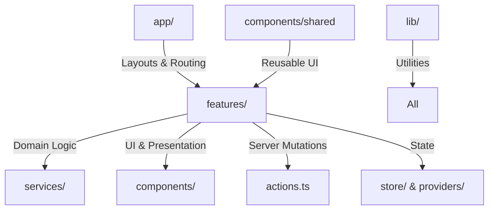
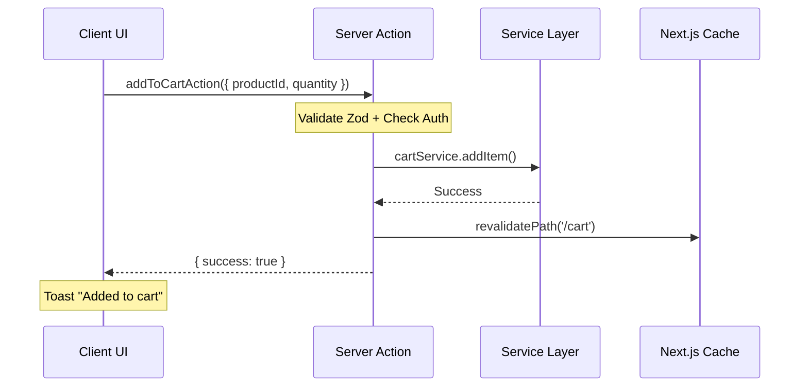

# Web Architecture & Implementation Guide (Deep Dive)

> **Version**: 2.1 (Deep Dive)
> **Stack**: Next.js 16 (App Router), TypeScript 5, Tailwind 4, Shadcn UI
> **State**: SWR (Read) + Server Actions (Write) + Zustand (Client Global)

Tài liệu này không chỉ mô tả "cái gì" mà giải thích sâu "tại sao" và "như thế nào" (how-to) cho các pattern cốt lõi của dự án.

---

## 1. Project Anatomy (Cấu trúc giải phẫu)

Chúng tôi sử dụng biến thể của **Feature-Sliced Design**, tối ưu cho Next.js App Router.



### 1.1 Detailed Structure

Mọi Feature (ví dụ `auth`, `cart`) đều PHẢI tuân thủ cấu trúc này:

```bash
features/auth/
├── components/          # 100% UI Components (Client/Server)
│   ├── login-form.tsx   # Complex Interactive Component
│   └── user-avatar.tsx  # Simple UI
├── hooks/               # Logic hooks (e.g. useLogin)
├── services/            # API Service Layer (Direct fetch to Backend)
│   └── auth.service.ts  # Class based services
├── providers/           # Context Providers scope only for this feature
├── store/               # Zustand stores (Rarely used, prefer URL state)
├── actions.ts           # Server Actions (The ONLY way to write data)
├── schemas.ts           # Zod Schemas (Shared with Backend if possible)
└── types.ts             # TypeScript Interfaces
```

> **Quy tắc vàng**: Không bao giờ import trực tiếp từ `features/A/components/X` vào `features/B`. Hãy export qua `features/A/index.ts` (Public API của module).

---

## 2. Data Flow Architecture (Luồng dữ liệu)

Chúng tôi áp dụng mô hình **CQRS-lite** (Command Query Responsibility Segregation) ở tầng Frontend.

### 2.1 Read Path (Query) - "Server First, Client SWR"

1.  **Initial Load (Server Component)**:
    - Sử dụng `fetch` hoặc Service để lấy dữ liệu ngay trên Server.
    - Truyền `initialData` xuống Client Component.
    - **Lợi ích**: SEO tốt, Zero Load Shift.

2.  **Client Update (SWR)**:
    - Client component sử dụng `useSWR` với `fallbackData` là `initialData` từ Server.
    - SWR tự động polling (nếu cần) hoặc revalidate on focus.

```typescript
// Example: Product List
// Server Component (Page)
export default async function ProductPage() {
  const initialData = await productService.getProducts();
  return <ProductList initialData={initialData} />;
}

// Client Component
export function ProductList({ initialData }) {
  const { data } = useSWR('/api/products', fetcher, { fallbackData: initialData });
  return <div>...</div>;
}
```

### 2.2 Write Path (Command) - "Safe Server Actions"

Mọi hành động ghi (Mutation) TUYỆT ĐỐI KHÔNG dùng API Route (`/api/...`). Phải dùng **Server Actions** được bọc bởi `next-safe-action`.

#### Flow chi tiết:

1.  **Client**: Gọi Action Wrapper (e.g. `addToCartAction`).
2.  **Middleware (`protectedActionClient`)**:
    - Tự động parse cookie `accessToken`.
    - Throw error nếu chưa login.
3.  **Validation (`Zod`)**:
    - Validate input trước khi chạy logic.
4.  **Service Layer**:
    - Gọi Backend API (REST/gRPC) từ Server của Next.js.
5.  **Revalidation**:
    - Gọi `revalidatePath` để xóa cache Server.
6.  **Response**:
    - Trả về `ActionResult<T>` chuẩn hóa `{ success: boolean, data?: T, error?: string }`.



---

## 3. Core Libraries Deep Dive

### 3.1 `lib/safe-action.ts` (The Guardian)

File này define 2 loại client:

1.  **`actionClient`**: Public actions (Login, Register).
2.  **`protectedActionClient`**: Tự động inject `ctx: { accessToken }`.

**Cơ chế `unwrapResult`**:
Thay vì để UI phải xử lý object phức tạp của `next-safe-action`, chúng tôi dùng `unwrapResult` để flatten kết quả về dạng đơn giản:

```typescript
{ success: true, data: ... } // hoặc
{ success: false, error: "Validation failed..." }
```

### 3.2 `lib/http.ts` (The Messenger)

Wrapper quanh `fetch` API, xử lý:

- Tự động thêm Base URL.
- Tự động thêm `Authorization: Bearer <token>`.
- Xử lý Refresh Token (nếu backend trả về 401).
- Serialize Body (JSON/FormData).

### 3.3 `middleware.ts` (The Gatekeeper)

Middleware được cấu hình cực kỳ chặt chẽ:

- **Regex Matcher**: Skip static files (`_next`, fonts, images) để tăng tốc.
- **i18n**: Xử lý `/[locale]` prefix.
- **Tenant Routing**: Rewrite URL dựa trên Hostname (`vn.shop.com` -> `tenantId: vn`).
- **Admin Guard**: Chặn route `/admin` nếu token không có quyền `admin:read`.

---

## 4. Authentication & Permissions Implementation

### 4.1 Hybrid Session State

- **Server-side Reference**: Cookie `accessToken`. Đây là source of truth.
- **Client-side Sync**: `AuthProvider` gọi `getPermissionsAction` khi mount để lấy danh sách quyền về client.
  - _Tại sao?_ Vì giải mã JWT token ở client là rủi ro và khó đồng bộ. Server giải mã và trả về danh sách strings `["product:create", "order:view"]`.

### 4.2 Permission Hook (`useAuth`)

```typescript
const { hasPermission } = useAuth();
if (hasPermission("admin:products:delete")) {
  return <DeleteButton />;
}
```

---

## 5. State Management Matrix

Hướng dẫn chọn nơi lưu state:

| Loại State            | Giải Pháp              | Ví dụ usage trong dự án                                    |
| :-------------------- | :--------------------- | :--------------------------------------------------------- |
| **Form State**        | `react-hook-form`      | Login form, Checkout detail form.                          |
| **URL State**         | `nuqs` (Search Params) | Filter sản phẩm `?color=red&size=m`, Pagination `?page=2`. |
| **Server Cache**      | **SWR**                | Danh sách sản phẩm, Chi tiết đơn hàng.                     |
| **UI State (Global)** | **Zustand**            | Trạng thái mở Sidebar, Cart drawer (isOpen), Theme config. |
| **Session**           | **React Context**      | `AuthContext`, `TenantContext`.                            |

> **Anti-pattern**: Dùng `useEffect` để sync data từ Server vào Redux/Zustand. **Hãy dùng SWR.**

---

## 6. Performance Optimization Checklist

### 6.1 Server Components (RSC)

- [x] Fetch data ở component cao nhất có thể (Page Level).
- [x] Pass data xuống dưới dạng props.
- [x] Tránh import `client components` lớn vào `server components` nếu không cần interaction.

### 6.2 Lazy Loading & Code Splitting

- Sử dụng `next/dynamic` cho các Heavy components:
  - Rich Text Editor (`TipTap` / `Quill`).
  - Charts (`Recharts`).
  - Map components.
  - Modals nặng (chỉ load khi mở).

### 6.3 Image Optimization

- Luôn define `sizes` prop chính xác cho `next/image`.
- Sử dụng format `WebP` (Next.js tự động xử lý).
- Bắt buộc `placeholder="blur"` cho ảnh Hero.

---

## 7. Error Handling Strategy

### 7.1 Server-side Errors

- Bắt lỗi ở Service Layer -> Throw Error.
- Action Wrapper catch Error -> Return `{ success: false, error: message }`.

### 7.2 Client-side Errors (SWR)

- Global `onError` in `SWRConfig` (trong `swr-provider.tsx`).
- Tự động Toast lỗi nếu status code là 5xx.
- Nếu 401 (Unauthorized) -> Redirect về Login.

### 7.3 Form Errors

- Map `validationErrors` từ Server Action trả về vào `react-hook-form` bằng `setError()`.
- Hiển thị inline message đỏ ngay dưới input.

---

## 8. Development Workflow

### Khi thêm 1 feature mới (VD: `Reviews`):

1.  **Define DTO**: Tạo `features/reviews/schemas.ts` (Form schema & API Response type).
2.  **Service**: Tạo `reviews.service.ts` gọi API Backend.
3.  **UI Components**: Tạo component hiển thị Review.
4.  **Server Action**: Tạo `features/reviews/actions.ts` (`submitReviewAction`).
5.  **Integration**:
    - Dùng Action trong Form (`useAction` hook của `next-safe-action` hoặc `useTransition`).
    - Xử lý loading state (`isPending`).
    - Xử lý success (`toast.success` + `form.reset`).
